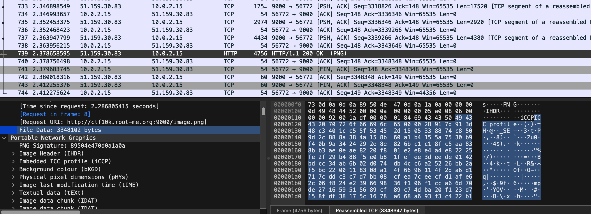
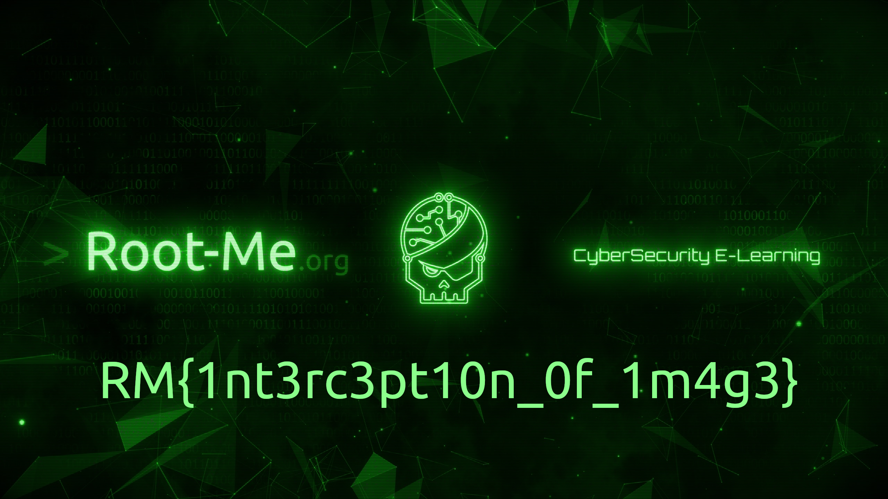

# ctf10kd

# ✅ Intro

## ✅ ARMed baby

Nom → Suggeste ARM

```
Hello, welcome to this challenge! Will you be able to correctly guess the number I prefer?%dWhat are you doing? It's not a number!How did you know? You can flag this challenge with this number inside of RM{}Nope!
```

Outils de reverse engineering pour ARM ? 

[](https://www.blackhat.com/presentations/bh-europe-04/bh-eu-04-dehaas/bh-eu-04-dehaas.pdf)

2004 — sûrement obsolète

[https://www.youtube.com/watch?v=gPsYkV7-yJk](https://www.youtube.com/watch?v=gPsYkV7-yJk)

Utilisation du site **dogbolt** :

[Decompiler Explorer](https://dogbolt.org/)

```c
int32_t _init(int32_t arg1, int32_t arg2)
{
    return call_weak_fn(arg1, arg2);
}

int32_t sub_3e8()
{
    /* jump -> nullptr */
}

void __cxa_finalize(void* d)
{
    /* tailcall */
    return __cxa_finalize(d);
}

int32_t printf(char* arg1, char const* format, ...)
{
    /* tailcall */
    return printf();
}

void __libc_start_main(
    int32_t (* main)(int32_t argc, char** argv, char** envp), int32_t argc, 
    char** ubp_av, void (* init)(), void (* fini)(), void (* rtld_fini)(), 
    void* stack_end) __noreturn
{
    /* tailcall */
    return __libc_start_main(main, argc, ubp_av, init, fini, rtld_fini, stack_end);
}

int32_t __gmon_start__()
{
    /* tailcall */
    return __gmon_start__();
}

int32_t __isoc99_scanf(char* arg1, char const* format, ...)
{
    /* tailcall */
    return __isoc99_scanf();
}

void abort() __noreturn
{
    /* tailcall */
    return abort();
}

int32_t _start(void (* arg1)(), void* arg2) __noreturn
{
    __libc_start_main(main, arg2, &arg_4, __libc_csu_init, __libc_csu_fini, arg1, &arg_4);
    /* no return */
}

void call_weak_fn(int32_t arg1, int32_t arg2)
{
    int32_t (* const r2)() = __gmon_start__;
    if (__gmon_start__ == 0)
    {
        return;
    }
    /* tailcall */
    return __gmon_start__(arg1, arg2, r2, &_GLOBAL_OFFSET_TABLE_);
}

int32_t deregister_tm_clones(int32_t arg1, int32_t arg2)
{
    return &__TMC_END__;
}

int32_t register_tm_clones()
{
    return &__TMC_END__;
}

void __do_global_dtors_aux()
{
    if (((uint32_t)__TMC_END__) != 0)
    {
        return;
    }
    if (__cxa_finalize != 0)
    {
        __cxa_finalize(__dso_handle);
    }
    deregister_tm_clones();
    __TMC_END__ = 1;
}

int32_t frame_dummy()
{
    /* tailcall */
    return register_tm_clones();
}

int32_t main(int32_t argc, char** argv, char** envp)
{
    printf("Hello, welcome to this challenge…", argv, envp, "Hello, welcome to this challenge…");
    int32_t var_10;
    int32_t r0;
    char* r1_1;
    r0 = __isoc99_scanf(&data_74c, &var_10);
    int32_t r3_1;
    if (r0 == 0)
    {
        printf("What are you doing? It's not a n…");
        r3_1 = 1;
    }
    else
    {
        int32_t r2 = var_10;
        if (r2 != n)
        {
            printf("Nope!", r1_1, r2, "Nope!");
        }
        else
        {
            printf("How did you know? You can flag t…", r1_1, r2, "How did you know? You can flag t…");
        }
        r3_1 = 0;
    }
    return r3_1;
}

void __libc_csu_init()
{
    void* r5 = &__init_array_start;
    int32_t r0;
    int32_t r1;
    _init(r0, r1);
    int32_t r4 = 0;
    do
    {
        r4 = (r4 + 1);
        int32_t r3_1 = *(int32_t*)r5;
        r5 = ((char*)r5 + 4);
        int32_t r2;
        r3_1(r0, r1, r2, r3_1);
    } while (1 != r4);
}

void __libc_csu_fini()
{
    return;
}

int32_t _fini()
{
    return;
}
```

Essais pour comprendre le fonctionnement des variables…

Lecture de la traduction faite par Hex-Rays :

```c
int n = 1333333337;                                                                // weak

//----- (000005C0) --------------------------------------------------------
int __cdecl main(int argc, const char **argv, const char **envp)
{
  int v5; // [sp+0h] [bp-Ch] BYREF

  printf("Hello, welcome to this challenge! Will you be able to correctly guess the number I prefer?");
  if (_isoc99_scanf("%d", &v5))
  {
    if (v5 == n)
      printf("How did you know? You can flag this challenge with this number inside of RM{}");
    else
      printf("Nope!");
    return 0;
  }
  else
  {
    printf("What are you doing? It's not a number!");
    return 1;
  }
}

```

Au final, la réponse est `RM{1333333337}`.

## ✅ Secured front

Dans le code source de la page :

```html
<!DOCTYPE html>
<html lang="en">
<head>
    <meta charset="UTF-8">
    <meta http-equiv="X-UA-Compatible" content="IE=edge">
    <meta name="viewport" content="width=device-width, initial-scale=1.0">
    <title>Secured front</title>
</head>
<body>
    <div id="content"></div>
    <script src="sc.js"></script>
    <style>
        body {
            display: block;
            width: max-content;
            margin: auto;
            margin-top: 300px;
            font-size: 2.5em;
            font-family: Arial, Helvetica, sans-serif;
        }
    </style>
</body>
</html>
```

```jsx
a = document.getElementById("content");
b = a;
i = a;
j = String.fromCharCode(51, 115, 123, 77, 82);
a = j;
s = a;
k = a;
k = s;
l = s.split("").reverse().join("");
b = [102, 120, 117, 52, 119, 124, 98, 119, 107, 117, 51, 120, 106, 107, 98, 51, 101];
h = Array(17).fill(4).map((e, z) => b[z] - e + 1);
d = [118, 102, 112, 119, 52, 113, 124, 120];
m = 10;
while (true) {
    m++;
    p = m;
    p -= 6;
    if (p > 0 && m > 2) {
        break
    }
}
j = Array(8).fill(0).map((e, v) => e + (p ^ d[v]));
d = prompt(String.fromCharCode(84, 101, 108, 108, 32, 109, 101, 44, 32, 119, 104, 97, 116, 32, 105, 115, 32, 116, 104, 101, 32, 102, 108, 97, 103));
if (h.map(t => String.fromCharCode(t)).join("") == d.substring(5, 22) && d.substring(0, 5) == l && j.map(t => String.fromCharCode(t)).join("") == d.substring(22)) {
    i.innerHTML = String.fromCharCode(67, 111, 114, 114, 101, 99, 116, 33, 32, 89, 111, 117, 32, 99, 97, 110, 32, 118, 97, 108, 105, 100, 97, 116, 101, 32, 116, 104, 105, 115, 32, 99, 104, 97, 108, 108, 101, 110, 103, 101, 32, 119, 105, 116, 104, 32, 116, 104, 105, 115, 33);
} else {
    i.innerHTML = String.fromCharCode(84, 111, 111, 32, 98, 97, 100, 32, 68, 58);
}
```

Ouverture de ces fichiers sur WebStorm.

Ajout des lignes suivantes pour que le débugger JS écrive la réponse attendue : 

```jsx
console.log(h.map((t) => String.fromCharCode(t)).join(""), " : ", d.substring(5, 22));
console.log(d.substring(0, 5), " : ", l);
console.log(j.map((t) => String.fromCharCode(t)).join(""), " : ", d.substring(22));
```

Ce qui donne :

```jsx
[Log] cur1ty_thr0ugh_0b – " : " – "" (sc.js, line 59)
[Log] a – " : " – "RM{s3" (sc.js, line 60)
[Log] scur1ty} – " : " – "" (sc.js, line 61)
```

Donc les caractères de d doivent être :

- de 0 à 4 : `RM{s3`
- de 5 à 21 : `cur1ty_thr0ugh_0b`
- après 22 : `scur1ty`

Ce qui donne : `RM{s3cur1ty_thr0ugh_0bscur1ty`

→ Avec un `}` en plus à la fin, ça fonctionne bien 😃

> Au final : `RM{s3cur1ty_thr0ugh_0bscur1ty}`
> 

## ✅ Auto travel

Quand on clique sur le lien, ça nous amène vers [cette vidéo](https://www.youtube.com/watch?v=dQw4w9WgXcQ&feature=youtu.be).

Détection des redirections grâce à [cet outil de GeekFlare](https://geekflare.com/tools/tests/fkpg4jen6) → rien

Paramètres Brave → Désactiver les scripts → On tombe sur une page vide à la place du Rick Roll

Inspection de ladite page :

```html
<!DOCTYPE html>
<html lang="en">
<head>
    <meta charset="UTF-8">
    <meta http-equiv="X-UA-Compatible" content="IE=edge">
    <meta name="viewport" content="width=device-width, initial-scale=1.0">
    <title>Auto travel</title>
</head>
<body>
    <div hidden>Yay! The flag is <pre>RM{I_st0pp3d_b3f0r3_b31ng_r1ckr0ll3d}</pre></div>
    <script>window.location = "https://youtu.be/dQw4w9WgXcQ"</script>
</body>
</html>
```

La solution est donc `RM{I_st0pp3d_b3f0r3_b31ng_r1ckr0ll3d}` !

## ✅ Deep inside

Un fichier : *message.enc*

```
%2E%2E%2E%2E%2E%20%2D%2E%2E%2E%2E%20%2E%2E%2E%2E%2E%20%2D%2D%2E%2E%2E%20%2D%2D%2E%2E%2E%20%2E%2E%2E%2D%2D%20%2D%2D%2E%2E%2E%20%2D%2D%2D%2E%2E%20%2E%2E%2E%2E%2D%20%2E%20%2E%2E%2E%2D%2D%20%2E%2D%2D%2D%2D%20%2D%2D%2E%2E%2E%20%2D%2D%2D%2D%2D%20%2E%2E%2E%2E%2D%20%2E%2E%2E%2E%2E%20%2E%2E%2E%2E%2E%20%2E%2E%2E%2E%2D%20%2E%2E%2E%2E%2E%20%2D%2D%2D%2E%2E%20%2D%2D%2E%2E%2E%20%2D%2D%2D%2D%2D%20%2D%2E%2E%2E%2E%20%2E%2D%20%2E%2E%2E%2E%2E%20%2E%2E%2D%2D%2D%20%2E%2E%2E%2E%2D%20%2E%2E%2E%2E%2E%20%2E%2E%2E%2D%2D%20%2E%2E%2E%2E%2E%20%2E%2E%2E%2D%2D%20%2E%2E%2E%2E%2E%20%2E%2E%2E%2E%2E%20%2D%2D%2E%2E%2E%20%2E%2E%2E%2E%2D%20%2E%2E%2E%2E%2D%20%2E%2E%2E%2E%2D%20%2E%20%2E%2E%2E%2E%2E%20%2E%2E%2E%2D%2D%20%2D%2E%2E%2E%2E%20%2E%2E%2D%2D%2D%20%2E%2E%2E%2D%2D%20%2D%2D%2D%2D%2D%20%2E%2E%2E%2D%2D%20%2E%2E%2E%2E%2E%20%2E%2E%2E%2E%2D%20%2D%2D%2D%2E%2E%20%2E%2E%2E%2E%2D%20%2E%20%2E%2E%2E%2E%2E%20%2D%2D%2E%2E%2E%20%2E%2E%2E%2E%2E%20%2E%2D%20%2E%2E%2E%2E%2D%20%2E%20%2E%2E%2E%2E%2D%20%2D%2E%2E%20%2E%2E%2E%2D%2D%20%2E%2D%2D%2D%2D%20%2D%2E%2E%2E%2E%20%2D%2E%2D%2E%20%2E%2E%2E%2D%2D%20%2D%2E%2E%2E%2E%20%2E%2E%2E%2E%2E%20%2D%2D%2D%2D%2E%20%2E%2E%2E%2D%2D%20%2E%2E%2D%2D%2D%20%2D%2D%2E%2E%2E%20%2D%2D%2E%2E%2E%20%2E%2E%2E%2D%2D%20%2E%2E%2E%2E%2E%20%2D%2E%2E%2E%2E%20%2E%2D%2D%2D%2D%20%2E%2E%2E%2E%2E%20%2E%2E%2E%2E%2E%20%2E%2E%2E%2D%2D%20%2D%2D%2D%2D%2D%20%2D%2D%2E%2E%2E%20%2D%2D%2D%2D%2E%20%2E%2E%2E%2E%2E%20%2D%2D%2E%2E%2E%20%2E%2E%2E%2E%2E%20%2D%2D%2D%2E%2E%20%2D%2E%2E%2E%2E%20%2E%2E%2E%2E%2D%20%2D%2E%2E%2E%2E%20%2E%2D%20%2D%2E%2E%2E%2E%20%2E%2D%2D%2D%2D%20%2D%2E%2E%2E%2E%20%2D%2E%2E%2E%20%2E%2E%2E%2D%2D%20%2E%2E%2E%2E%2D%20%2E%2E%2E%2D%2D%20%2E%2E%2E%2E%2E
```

Ça ressemble à de l’hexadécimal.

J’enlève les `%` avec la commande `sed 's/%//g' ./message.enc`

```
2E2E2E2E2E202D2E2E2E2E202E2E2E2E2E202D2D2E2E2E202D2D2E2E2E202E2E2E2D2D202D2D2E2E2E202D2D2D2E2E202E2E2E2E2D202E202E2E2E2D2D202E2D2D2D2D202D2D2E2E2E202D2D2D2D2D202E2E2E2E2D202E2E2E2E2E202E2E2E2E2E202E2E2E2E2D202E2E2E2E2E202D2D2D2E2E202D2D2E2E2E202D2D2D2D2D202D2E2E2E2E202E2D202E2E2E2E2E202E2E2D2D2D202E2E2E2E2D202E2E2E2E2E202E2E2E2D2D202E2E2E2E2E202E2E2E2D2D202E2E2E2E2E202E2E2E2E2E202D2D2E2E2E202E2E2E2E2D202E2E2E2E2D202E2E2E2E2D202E202E2E2E2E2E202E2E2E2D2D202D2E2E2E2E202E2E2D2D2D202E2E2E2D2D202D2D2D2D2D202E2E2E2D2D202E2E2E2E2E202E2E2E2E2D202D2D2D2E2E202E2E2E2E2D202E202E2E2E2E2E202D2D2E2E2E202E2E2E2E2E202E2D202E2E2E2E2D202E202E2E2E2E2D202D2E2E202E2E2E2D2D202E2D2D2D2D202D2E2E2E2E202D2E2D2E202E2E2E2D2D202D2E2E2E2E202E2E2E2E2E202D2D2D2D2E202E2E2E2D2D202E2E2D2D2D202D2D2E2E2E202D2D2E2E2E202E2E2E2D2D202E2E2E2E2E202D2E2E2E2E202E2D2D2D2D202E2E2E2E2E202E2E2E2E2E202E2E2E2D2D202D2D2D2D2D202D2D2E2E2E202D2D2D2D2E202E2E2E2E2E202D2D2E2E2E202E2E2E2E2E202D2D2D2E2E202D2E2E2E2E202E2E2E2E2D202D2E2E2E2E202E2D202D2E2E2E2E202E2D2D2D2D202D2E2E2E2E202D2E2E2E202E2E2E2D2D202E2E2E2E2D202E2E2E2D2D202E2E2E2E2E
```

Traduction Hex→texte avec [ce site](https://www.duplichecker.com/hex-to-text.php) :

```
..... -.... ..... --... --... ...-- --... ---.. ....- . ...-- .---- --... ----- ....- ..... ..... ....- ..... ---.. --... ----- -.... .- ..... ..--- ....- ..... ...-- ..... ...-- ..... ..... --... ....- ....- ....- . ..... ...-- -.... ..--- ...-- ----- ...-- ..... ....- ---.. ....- . ..... --... ..... .- ....- . ....- -.. ...-- .---- -.... -.-. ...-- -.... ..... ----. ...-- ..--- --... --... ...-- ..... -.... .---- ..... ..... ...-- ----- --... ----. ..... --... ..... ---.. -.... ....- -.... .- -.... .---- -.... -... ...-- ....- ...-- .....
```

→ Code morse. Traduction avec [ce site](https://morsecode.world/international/translator.html) :

```
565773784E3170455458706A5245353557444E53623035484E575A4E4D316C3659327735615530795758646A616B3435
```

J’enlève les chiffres avec la commande `sed 's/[0-9]//g' ./message_3.enc` → `EAEEAEDCAB` — 

Le site [dcode](https://www.dcode.fr/cipher-identifier) pense qu’il s’agit du Nihilist Cipher. Test → il faut une grille de décodage (?)

```
56 57 73 78 4E 31 70 45 54 58 70 6A 52 45 35 35 57 44 4E 53 62 30 35 48 4E 57 5A 4E 4D 31 6C 36 59 32 77 35 61 55 30 79 57 58 64 6A 61 6B 34 35
```

Conversion ASCII (hexa) → texte ([site](https://www.dcode.fr/code-ascii)) : 

```
VWsxN1pETXpjRE55WDNSb05HNWZNM1l6Y2w5aU0yWXdjak45
```

Conversion Base64 → texte :

```
Uk17ZDMzcDNyX3RoNG5fM3Yzcl9iM2YwcjN9
```

Deuxième conversion Base64 → texte :

```
RM{d33p3r_th4n_3v3r_b3f0r3}
```

Solution : `RM{d33p3r_th4n_3v3r_b3f0r3}`

## ✅ ****Intercept me****

Ouverture du fichier *capture.pcapng* avec TextEdit : je remarque une metion de Wireshark.

Téléchargement de Wireshark et ouverture du fichier *capture.pcapng* avec.

Indice donné : “TLS? Never heard of that before, sorry”

Requête d’une image depuis [http://ctf10k.root-me.org:9000/image.png](http://ctf10k.root-me.org:9000/image.png)

Export des données en binaire pour retrouver l’image png : 





## ✅ ****Community****

> *Find the mini-flags in RootMe's social networks (Discord, Youtube, Twitch, Twitter) Format of the flag : RM{DIS(XXX)-YT(XXX)-TCH(XXX)-TWI(XXX)}*
> 
- Discord : description du channel général ctf — DIS(Rés)
- YouTube : miniature d’une des vidéos — YT(EAUX)
- Twitch : TCH(50) (bruteforcé)
- Twitter : localisation — TWI(c14uX)

→ `RM{DIS(Rés)-YT(EAUX)-TCH(50)-TWI(c14uX)}`

# OSINT

## ✅ At that time

> *I can't find this information but I need it to write a report to the administrators. How many challenges, virtual machines and solutions were there published on **October 18, 2014** on the root-me platform?*
> 

Wayback machine : [https://web.archive.org/web/20141018192412/http://www.root-me.org/](https://web.archive.org/web/20141018192412/http://www.root-me.org/)

162 challenges, 22 machines virtuelles, 521 solutions

→ `RM{162_22_521}`

## ✅ ****Somewhere in France - Geosint 1/4****

Pas de métadonées exploitables


Google images reverse : Château de Roquetaillade

[](https://en.wikipedia.org/wiki/Ch%C3%A2teau_de_Roquetaillade)

`RM{castle_roquetaillade}`

## ✅ ****Watch some movies ? - Geosint 2/4****


Google lense → [https://en.wikipedia.org/wiki/Putangirua_Pinnacles](https://en.wikipedia.org/wiki/Putangirua_Pinnacles)

→ [https://en.wikipedia.org/wiki/The_Lord_of_the_Rings:_The_Return_of_the_King](https://en.wikipedia.org/wiki/The_Lord_of_the_Rings:_The_Return_of_the_King)

Famous movie : ***The Lord of the Rings: The Return of the King***

`RM{the_return_of_the_king}`

## ✅ ****On holiday - Geosint 3/4****


Nom de la route / chemin en français

Google lenses : **Camping Miralago, Parc naturel régional du massif des Bauges**

Adresse : Via Statale 28, 22014 Dongo Italy (fausse piste)

**Parc naturel régional du massif des Bauges**

Métadonnées : rien

TinEye : rien

[GUIDE: Where was that photo taken? How to locate (almost) any place on Earth](https://africacheck.org/fact-checks/guides/guide-where-was-photo-taken-how-locate-almost-any-place-earth)

*“flag is in french”* → France ?


Promenade des Seines (Annecy)

RM{promenade_des_seines}

## ✅ ****A messed up picture - Geosint 4/4****


`RM{mount_rushmore}`

## ****Find our roots****


Bateau volé, trouver nom du bateau + call sign (numéro d’immatriculation)

[https://zijda.nl/en/yachts/viking-elite/](https://zijda.nl/en/yachts/viking-elite/) : non (arrière différent)

Drapeau du Pays-Bas

Écriture “Kamerik” à gauche ? Kamerik = village des Pays-Bas

“Kamenik” selon Google Lens

[https://www.itu.int/mmsapp/ShipStation/list](https://www.itu.int/mmsapp/ShipStation/list) pour numéros

RM{LIEMERIK_PF7922} → non

# Programming

## RPN

> Who needs parentheses when you can use Jan's RPN to get an unambiguous formula?
> 

```bash
$ nc ctf10k.root-me.org 800
Can you solve this for me?
613 16 222 x x 607 -
```

[Le RPN : qu'est-ce-que c'est ?](https://le-rayon-des-calculatrices.fr/WordPress3/?p=1279)

```bash
444 720 + 346 594 x + 248 - 837 x 115 247 360 + 987 667 - - - - 402 818 x 400 x 66 205 449 - + x -
638 448 + 362 + 120 + 231 122 389 - - + 34 44 903 + 631 - 507 244 - - - 919 x 580 394 - - x
58 217 + 684 + 724 7 899 - x x 971 11 511 x - x
```

Script de calcul OK

Problème : comment renvoyer le résultat dans le shell ayant appelé `nc` ?

# Web

## GLP-Me

```bash
Select id from users where username=’username’ and password=’password’ or 1=1--+
```

Injection SQL ?

